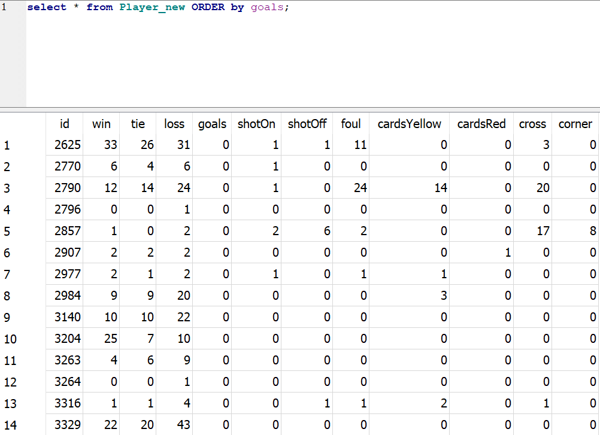

# Base de datos jugadores europeos 2008 – 2016

En este repositorio se estudiará la base de datos de jugadores europeos con el fin de crear un dataframe, en el cual se almacene los datos individuales de los jugadores. Durante la creación de este dataframe se buscó aquellas variables que fueran considerados relevantes para realizar una evaluación de los jugadores.

## Python scrips

Dentro de la base de datos de jugadores europeos fue la tabla match la que contaba con la información mas relevante para esta investigación, dado que poseía los datos específicos de cada partido, como los resultados, y los participantes de acciones, como las conversiones de goles, remates, faltas y demás acciones.

Dada la importancia de la tabla Match fue creada la tabla MatchExtended, que agrega información de otras tablas. La información agregada a la tabla MatchExtended no fue considerada para la creación de la tabla individual de jugadores, pero sirvió para la exploración de los datos. Esta tabla es creada en el archivo sqlMatchNewVersion.py.

En el archivo XMLManagment.py fue creada la clase XmlMatches, que implementa métodos para procesar la información almacenada en formato xml, formato preponderante en la tabla MatchExtended, particularmente en datos referentes a acciones individuales. Al explorar el archivo se observarán gran número de métodos específicos, los cuales permiten extraer la información de las diferentes entidades de la tabla matches, que están almacenadas en el formato xml. Finalmente, esta información queda guardada en las propiedades de la clase. 

En el archivo sqlPlayerPerMatch.py se encuentra la clase DataBase, la cual permite la extracción de información desde la base de datos, permitiendo la manipulación de la base de datos desde Python. El método mas destacado es select_match_extended, que permite la extracción de la información de un partido concreto, almacenando la información en las propiedades de la clase, e implementando los métodos de la clase XmlMatches para procesar la información que se encontraba almacenada en xml.

Es a partir de esta ultima clase que se inicia la creación de la tabla con los datos individuales por jugador. En el archivo inicialice_new_players.py se inicializa la tabla con los datos de los jugadores, agregando todos los jugadores a partir de su id, y teniendo como cero todos los valores de las celdas de la tabla.

Finalmente en el archivo dataPerPlayer.py se hace un loop que va agregando la información de cada partido a los diferentes jugadores. Los datos almacenados en xml fueron procesados como listas, actualizando los valores de cada uno de los jugadores según correspondía. Para los resultados de los partidos la información fue ingresada con la implementación de bloques condicionales.

## ¿Qué insights ves en la información detallada del partido?

En la información del partido se logra ver una gran cantidad de información interesante. Primero que nada, se ven datos referentes al partido, como lo son la fecha del encuentro, la temporada y el resultado del encuentro.

En segundo lugar, se ve información referente a los jugadores que participaron del partido, permitiendo tener los datos de id de cada jugador participante del encuentro.

En tercer lugar se puede ver información referente al contenido del partido, información que fue recopilada para tener un recuento de las acciones de cada jugador. Acciones como goles, disparos que fueron y no al arco, faltas cometidas, tarjetas recibidas, tiros de esquina y centros ejecutados.

Por ultimo se muestran datos de premios ofrecidos por casas de apuestas, siendo esta información no relevante para la pregunta de investigación.

## ¿Qué insights ves en el perfil por jugador? ¿Qué data crees que es relevante para elegir a los mejores jugadores?

Respecto a la primera pregunta fueron considerados las siguientes variables:

-	Resultados en partidos en los cuales participaron los jugadores (victoria, empate y derrota)
-	Goles
-	Remates al arco y remates desviados
-	Faltas cometidas
-	Tarjetas amarillas y rojas recibidas
-	Centros y tiros de esquina ejecutados

Respecto a la segunda pregunta considero que la información que pudo ser recopilada cuenta con varias limitantes. La principal falencia es que falta mucha información para determinar la incidencia de un jugador, considero fundamentales para resolver el problema datos como pases completados, duelos ganados, regates por partido, entradas y recuperaciones.

Con la información vigente existen medidas poco satisfactorias para extraer a los mejores jugadores, como la cantidad de victorias. Esta variable permitirá acercarnos bastante a buenos jugadores, pero mantendrá en el ostracismo jugadores de equipos menores que tienen un buen desempeño individual, siendo en su evaluación perjudicados a partir de los fracasos colectivos de su equipo. A su vez jugadores con un desempeño deficiente, inmersos en un equipo con buenos resultados, terminan siendo sobrevalorados.

A grandes rasgos la información proveída puede ser útil para seleccionar a los mejores finalizadores, midiendo el ratio de disparos y goles convertidos, mas no entrega información relevante para delanteros como lo es la velocidad, desbordes por partido, etcétera. Respecto a los mediocampistas y los defensas falta información relevante a sus funciones. En cuanto los porteros se podría medir la cantidad de goles recibidos respecto a los remates recibidos en el encuentro lo cual podría generar conclusiones acercadas a la realidad.

